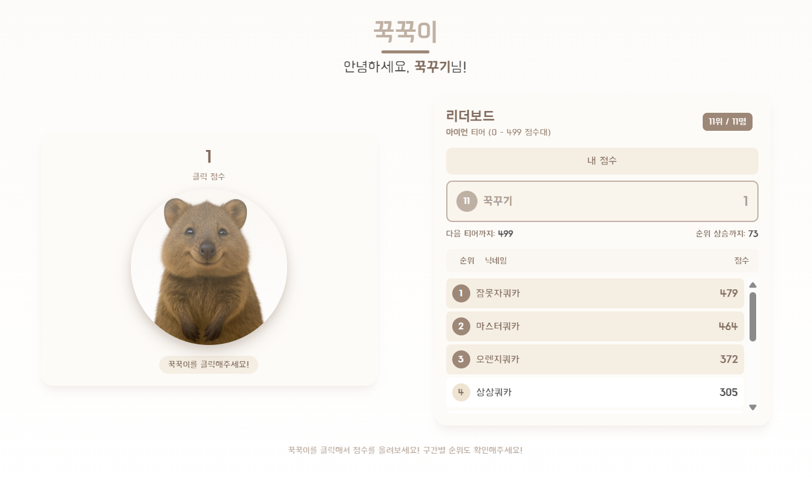

# 꾹꾹이 (Kkuk-Kuki)


## 귀여운 쿼카를 클릭하는 중독성 있는 클리커 게임

[](https://reactjs.org/)
[](https://www.typescriptlang.org/)
[](https://tailwindcss.com/)
[](https://vitejs.dev/)

## 🎮 게임 소개

**꾹꾹이**는 사용자가 쿼카 이미지를 클릭하여 점수를 얻는 간단하지만 중독성 있는 웹 게임입니다. 점수를 올려 다양한 티어를 통과하며 다른 플레이어들과 경쟁해보세요!

### 주요 기능

- **닉네임 설정** - 게임 시작 시 닉네임을 입력하여 개인화된 경험 제공
- **쿼카 클리커** - 귀여운 쿼카 이미지를 클릭하여 점수 획득
- **티어 시스템** - 점수에 따라 아이언부터 챌린저까지 9개의 티어로 진행
- **실시간 리더보드** - 같은 티어 내의 다른 플레이어들과 실시간 경쟁
- **반응형 디자인** - 모바일과 데스크톱 모두에서 최적화된 경험

### 티어 시스템

| 티어 | 점수 범위 |
|:------:|:----------:|
| **아이언** | 0-499 |
| **브론즈** | 500-999 |
| **실버** | 1000-1499 |
| **골드** | 1500-1999 |
| **플래티넘** | 2000-2499 |
| **다이아몬드** | 2500-2999 |
| **루비** | 3000-3499 |
| **마스터** | 3500-3999 |
| **챌린저** | 4000+ |

## 🚀 시작하기

### 설치

```bash
# 저장소 클론
git clone https://github.com/yourusername/kkuk-kuki.git
cd kkuk-kuki

# 의존성 설치
npm install

# 개발 서버 실행
npm run dev
```

### 빌드

```bash
# 프로덕션 빌드
npm run build
```

## 🛠️ 기술 스택

- **프론트엔드**: React, TypeScript
- **스타일링**: Tailwind CSS
- **빌드 도구**: Vite
- **상태 관리**: React Hooks (useState, useEffect, useCallback, useMemo)

## 📱 스크린샷



## 📄 라이센스

MIT 라이센스에 따라 배포됩니다. 자세한 내용은 [LICENSE](LICENSE) 파일을 참조해주세요.
